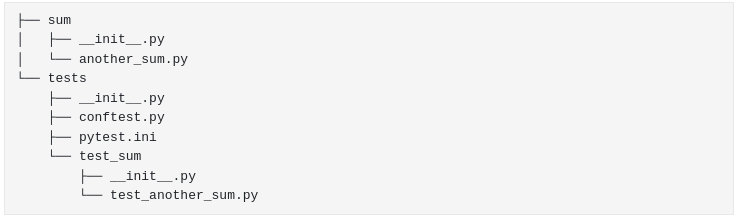
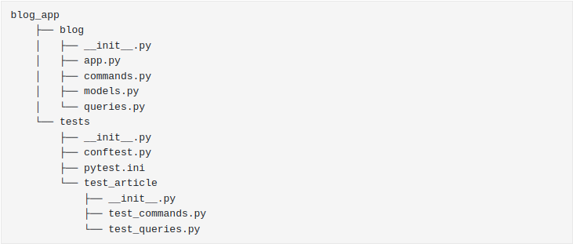

# Test-Driven Development in Python
This repository documents my learning process for test-driven development (TDD) in Python.

## Python TDD Packages
The Python package pytest is used here, and development initially follows [this walkthrough](https://testdriven.io/blog/modern-tdd/).

In addition, the email part of the pydantic package is used to provide testing of some of the database fields.
### Basic Structure for TDD with pytest
The project should be structured as shown below (from the walkthrough) to enable pytest to be used for TDD. This is the structure for a simple summing application developed earlier in the walkthrough.

### Commands
#### Running Tests
For the above example, tests can be executed by running

python -m pytest tests

#### Clearing Database Between Tests: pytest fixtures
pytest fixtures can be used or this. These are functions decorated with a @pytest.fixture decorator, usually within conftest.py but possibly also within the actual test files.

Can additionally enter the keyword <strong>yield</strong> within a pytest fixture, which allows code above it to be run before the test and code below it afterwards.

A default argument of <strong>autouse=True</strong> means that the fixture will be used before and after every test run.

### Code Coverage
A pytest plugin for coverage called pytest-cov is used to check code coverage. This allows code coverage to be checked using

python -m pytest tests --cov=blog

## End-to-End Tests
At this point AI is fully working, and can be tested end-to-end. The request library is installed to enable this.
End-to-end only tests can be run using 

python -m pytest tests -m 'e2e'

While all tests except end-to-end can be run using

python -m pytest tests -m 'not e2e'

It is worth remembering that these (e2e) tests need to be run with the server running.

## Flask Blog App
The project developed using the TDD methodology is a blog app using Flask. Its TDD deployment using a RESTful API is covered below.

To run the Flask app, type the following into the terminal:

FLASK_APP=blog/app.py python -m flask run
## Packages
In addition to Flask, the packjage jsonschema is used to validate JSON payloads against defined schemas.
## Final Directory Structure for Tested App

